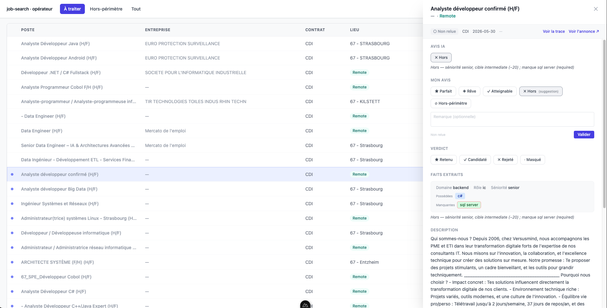

# job-search

Un outil qui trie des offres d'emploi à ma place, pour que je ne lise que celles qui valent la peine.

Il collecte des offres sur plusieurs sources, fait extraire par un LLM local ce que chaque offre exige, puis les classe en Python selon un profil candidat écrit en YAML. **Le système filtre et classe, il ne décide pas** : la décision de postuler reste humaine.



## Comment ça marche

```
sources ──► déduplication ──► filtres durs ──► extraction LLM ──► scoring Python ──► interface web
```

**Le LLM ne parle qu'une fois par offre, et dans un vocabulaire fermé.** À l'ingestion, un modèle local (Ollama) lit l'annonce et rend des faits structurés : séniorité, niveau de rôle, domaine, technos avec leur importance, langues exigées. Rien d'autre, jamais de texte libre. C'est ce qui rend le scoring déterministe possible par-dessus.

**Le scoring est du Python, pas du LLM.** Chaque offre est notée sur deux axes indépendants, calculés à partir des faits extraits et du profil :

|                   | Atteignable    | Non atteignable |
|-------------------|----------------|-----------------|
| **Désirable**     | Offre parfaite | Offre de rêve   |
| **Non désirable** | Atteignable    | Hors            |

Conséquence : modifier le profil (une compétence, une zone, un seuil) recalcule tout à froid, sans rappeler le modèle. Seul l'élargissement du vocabulaire d'extraction oblige à réextraire.

**Chaque classement s'explique.** L'interface affiche pourquoi une offre tombe dans sa case : compétences possédées, compétences manquantes, écart de séniorité.

**Chaque appel au modèle est tracé** (prompt système, prompt utilisateur, réponse) et peut être annoté. C'est le matériau de l'analyse d'erreurs, et le système a été refondu plusieurs fois à partir des erreurs observées.

**Une offre écartée n'est jamais perdue.** Les exclusions (contrat non visé, poste de management, aucune techno identifiable) sont des décisions personnelles, pas techniques : l'offre reste catégorisée et revient à sa place si la règle change.

## Deux vues

- **Vue candidat** : utiliser l'outil. Quatre onglets par intention (Cibles, Gaps, Filet, Retenues), filtrés sur les zones géographiques visées.
- **Vue opérateur** : tester l'outil. Offres à traiter, offres hors périmètre avec leur cause, traces LLM. C'est ici qu'on vérifie que les filtres ne coupent pas ce qu'ils ne devraient pas.

## Stack

Python · FastAPI · SQLite · Ollama · Nuxt 4 · Tailwind · Pinia

```
job-search/
├── orchestrator/   pipeline : collecte, extraction, scoring (CLI)
├── api/            FastAPI : offres, verdicts, traces
├── web/            interface Nuxt
├── profiles/       profil candidat YAML + alias de technos
└── tests/
```

## Installation

Prérequis : Python 3.11+, Node 20+, [Ollama](https://ollama.com) avec un modèle installé.

```bash
python3 -m venv .venv && source .venv/bin/activate
pip install -r requirements.txt
cp .env.example .env                              # identifiants France Travail, hôte et modèle Ollama
cp profiles/example.yaml profiles/moi.yaml        # votre profil : compétences, zones, contrats
```

### Lancer

```bash
# Pipeline complet : collecte → extraction → scoring
python -m orchestrator.job_search.run --profile profiles/moi.yaml

# API
uvicorn api.main:app --reload                     # http://localhost:8000

# Interface
cd web && npm install && npm run dev              # http://localhost:3000
```

### Recalculer sans recollecter

```bash
python -m orchestrator.job_search.rescore --profile profiles/moi.yaml             # offres sans catégorie
python -m orchestrator.job_search.rescore --force --profile profiles/moi.yaml     # toutes les offres
python -m orchestrator.job_search.rescore --re-extract --profile profiles/moi.yaml  # réextraction LLM
python -m orchestrator.job_search.rescore --dry-run --profile profiles/moi.yaml   # sans écrire en base
```

## Le profil

`profiles/example.yaml` montre le format : compétences notées sur deux échelles (niveau réel et envie), zones géographiques, types de contrat, plafond de séniorité. Le barème de niveau est dans `docs/bareme-niveau.md`. `profiles/alias.yaml` unifie les écritures d'une même techno (« JS », « JavaScript »…).
